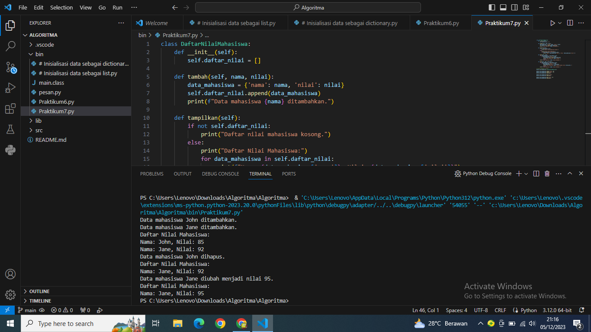
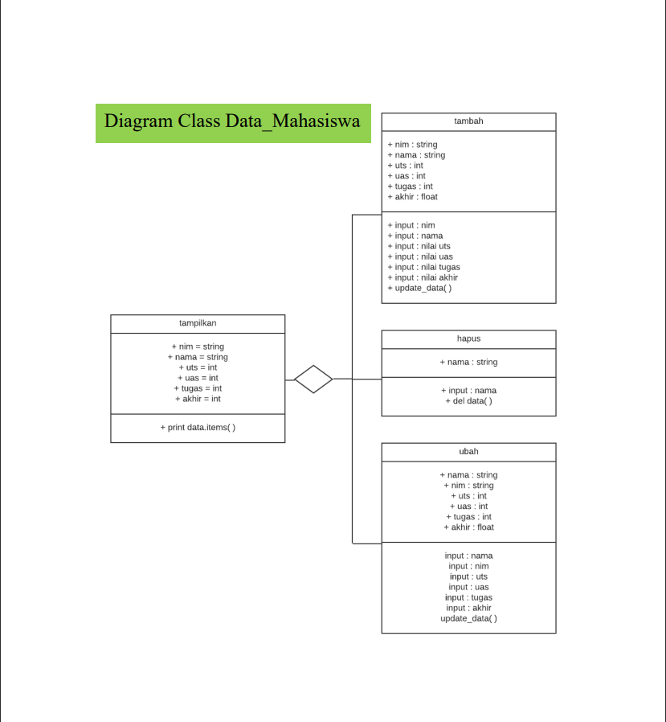
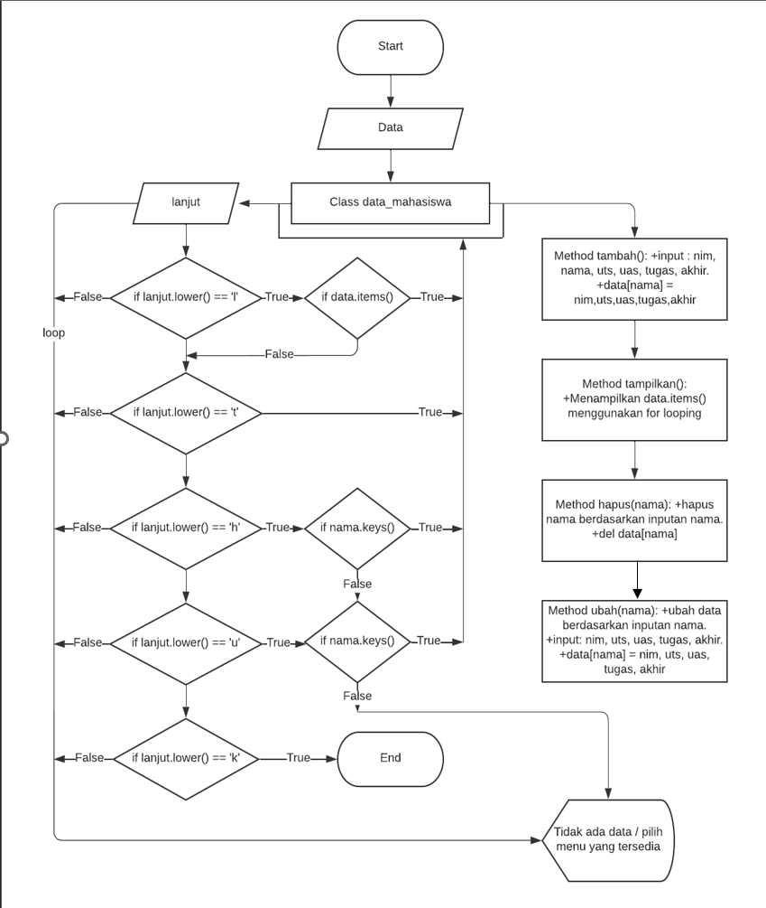

# Praktikum7

---------------------------------------------------------------------------------------------------------------------------------------------------------------------------------------

Penjelasan Program:

Kelas DaftarNilaiMahasiswa memiliki atribut daftar_nilai yang merupakan daftar mahasiswa beserta nilai.

Metode tambah digunakan untuk menambahkan data mahasiswa ke dalam daftar.

Metode tampilkan digunakan untuk menampilkan seluruh daftar nilai mahasiswa.

Metode hapus digunakan untuk menghapus data mahasiswa berdasarkan nama.

Metode ubah digunakan untuk mengubah nilai mahasiswa berdasarkan nama.

Program ini menciptakan objek dari kelas DaftarNilaiMahasiswa dan mengeksekusi beberapa operasi untuk menambahkan, menampilkan, menghapus, dan mengubah data mahasiswa.

---------------------------------------------------------------------------------------------------------------------------------------------------------------------------------------

Penjelasan Flowchart:
Start:

Program dimulai.
Input:

Pengguna memasukkan data mahasiswa.
Tambah Data:

Program memanggil metode tambah untuk menambahkan data mahasiswa ke dalam daftar.
Tampilkan Data:

Program memanggil metode tampilkan untuk menampilkan daftar nilai mahasiswa.
Hapus Data:

Pengguna memasukkan nama mahasiswa yang ingin dihapus.

Program memanggil metode hapus untuk menghapus data mahasiswa berdasarkan nama.
Ubah Data:

Pengguna memasukkan nama mahasiswa dan nilai baru.

Program memanggil metode ubah untuk mengubah data mahasiswa berdasarkan nama.
Tampilkan Data:

Program memanggil metode tampilkan untuk menampilkan daftar nilai mahasiswa setelah perubahan.
End:

Program berakhir.
